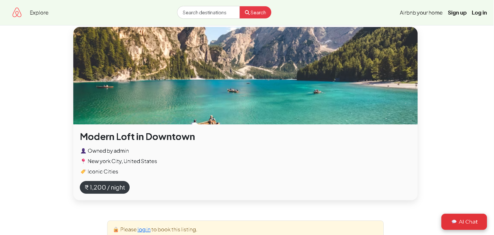

````markdown
# 🏠 Airbnb Clone

A full-stack **Airbnb-like booking platform** built with **Node.js, Express, MongoDB, EJS**, and integrated with **Cloudinary, Razorpay, and Passport.js**.  
Features include property listings, booking management, payments, reviews, AI chatbot assistance, and more.  

🌐 **Live Demo:** [sigma-project-vgid.onrender.com](https://sigma-project-vgid.onrender.com)

---

## ✨ Features

- **User Authentication**
  - Google OAuth 2.0 & local authentication
  - Secure sessions & password hashing
- **Property Listings**
  - Create, update, delete, and view listings
  - Image uploads via **Cloudinary**
- **Booking System**
  - Prevents double bookings
  - Razorpay integration for secure payments
  - Server-side payment verification
- **Reviews**
  - Star-based review system
  - Validation and author-only deletion
- **Search & Filters**
  - Category-based filtering
  - Search using MongoDB `$regex` queries
- **AI Chatbot**
  - Powered by [Chatbase.com](https://www.chatbase.co/)
  - Answers user queries, guides property searches, and assists in booking

---

## 🛠 Tech Stack

**Frontend:**  
- EJS (Embedded JavaScript Templates)  
- CSS

**Backend:**  
- Node.js  
- Express.js  
- MongoDB (Mongoose ODM)  
- Passport.js (Authentication)  
- Razorpay API (Payments)  
- Cloudinary API (Image storage)  

**Other:**  
- Google OAuth 2.0  
- Chatbase AI Chatbot  

---

## 🚀 Installation & Setup

1. **Clone the repository**
   ```bash
   git clone https://github.com/Ganeshjh2004/Airbnb.git
   cd Airbnb
````

2. **Install dependencies**

   ```bash
   npm install
   ```

3. **Create a `.env` file** in the project root with the following variables:

   ```env
   PORT=3000
   MONGO_URI=your_mongodb_connection_string
   CLOUDINARY_CLOUD_NAME=your_cloudinary_name
   CLOUDINARY_API_KEY=your_cloudinary_key
   CLOUDINARY_API_SECRET=your_cloudinary_secret
   RAZORPAY_KEY_ID=your_razorpay_key_id
   RAZORPAY_KEY_SECRET=your_razorpay_secret
   GOOGLE_CLIENT_ID=your_google_client_id
   GOOGLE_CLIENT_SECRET=your_google_client_secret
   SESSION_SECRET=your_session_secret
   ```

4. **Run the app**

   ```bash
   npm start
   ```

5. Open [http://localhost:3000](http://localhost:3000) in your browser.

---

## 🖼 Screenshots

### **Home Page**


### **Listing Details**


### **Review System**

---

💡 Possible Improvements
📅 Add an interactive booking calendar

🗺 Integrate Google Maps API for property location

📊 Admin dashboard for managing listings and users

📱 Fully responsive mobile-first design

🔍 Advanced filters (price range, ratings, amenities)

---

## 📝 License

This project is licensed under the MIT License.


